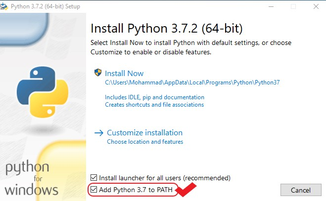
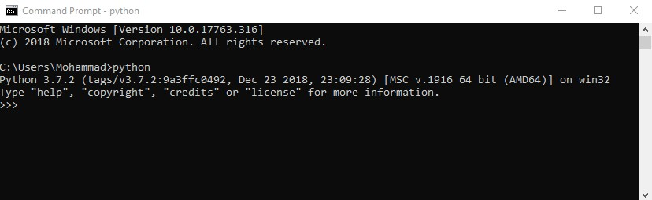

# Visual Studio Code Lab 1.1:
---
## Getting started with Visual Studio Code
---

### Prerequisites 
* A computer system with internet connectivity.
* Download and install Visual Studio Code software as described in Step 1.
* Download and install PYTHON as described in Step 2.

 ### Topics to Cover
 * Installing Visual Studio Code software
 * Installing PYTHON
 * Get familiar with the Visual Studio Code
 * Create and run hello world sample in Visual Studio Code by python
---
 ## Step 1 - Installing Visual Studio Code Software (if you do not have it already)
 VS Code is lightweight and should run on most available hardware and platform versions.**

* Requirements for Visual Studio Code
    * Hardware (recommend)
        * 1.6 GHz or faster processor
        * 1 GB of RAM
    * Platforms
        * Windows 7 (with .NET Framework 4.5.2), 8.0, 8.1 and 10 (32-bit and 64-bit)
        * OS X Yosemite
        * Linux (Debian): Ubuntu Desktop 14.04, Debian 7
        * Linux (Red Hat): Red Hat Enterprise Linux 7, CentOS 7, Fedora 23


 * Additional Windows requirements :
    * .NET Framework 4.5.2 is required for VS Code. If you are using Windows 7, please make sure .NET Framework 4.5.2 is installed.

* Installation
    1. Download the [Visual Studio Code installer](https://code.visualstudio.com/download) for Windows.
    2. Run the installer (VSCodeUserSetup-{version}.exe). 
    3. By default, VS Code is installed under `C:\users\{username}\AppData\Local\Programs\Microsoft VS Code`.


> From the console type 'code .' it opens VS Code .
Restart your console after the installation 


 ## Step 2 - Installing Python (if you do not have it already)
 * Installation
    1. Download the [Python installer](https://www.python.org/downloads/windows/) version 3.X (for which this tutorial is written) for Windows.
    2. Run the installer (python-{version}-amd64.exe).
    3. Be sure that `Add Python 3.7 to PATH` option checked.

    

    4. If you have Python installed check the version number 

    ```bash
    python
    ```

    
    
