# Create and run hello world sample in Visual Studio Code by python

1. Start VS Code in a project (workspace) folder.
* At a command prompt or terminal, enter the following commands 

```bash
mkdir hello
cd hello
code .
```

2. Create a Python Hello World source code file
From the `File Explorer` toolbar, click the `New File` button on the hello folder:

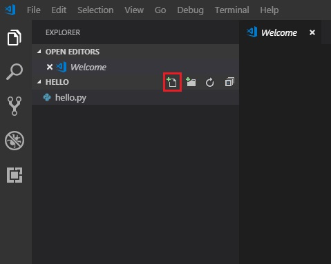


3. Name the file `hello.py`, and it automatically opens in the editor:

4. Start entering the following source code if using Python 3:

```python
msg = "Hello World"
print(msg)
```

* When you start typing print, notice how `IntelliSense` presents auto-completion options.

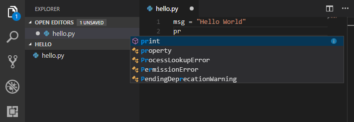


Type msg.:

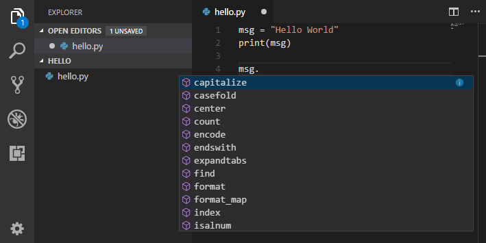


Save the file (Ctrl+S).

* Or checked **File > Auto Save** from menu to auto save changes.

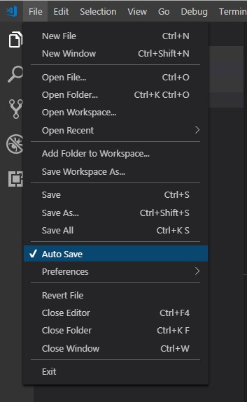


5. Select a Python interpreter
Python is an interpreted language, and in order to run Python code and get Python IntelliSense, you must tell VS Code which interpreter to use.

    * From within VS Code, select a Python 3 interpreter by opening the **Command Palette (Ctrl+Shift+P)**, start typing the **Python: Select Interpreter** command to search, then select the command.<p style="text-align:center;">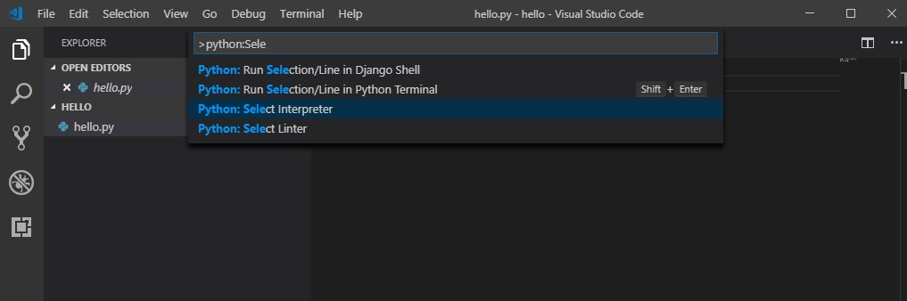</p>

    * You can also use the **Select Python Environment** option on the Status Bar if available (it may already show a selected interpreter, too):<p style="text-align:center;">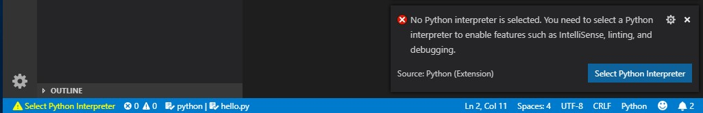</p>

6. Enable linters
    * Linting highlights syntactical and stylistic problems in your Python source code, which oftentimes helps you identify and correct subtle programming errors or unconventional coding practices that can lead to errors.

    * To enable linters other than the default PyLint, open the Command Palette (Ctrl+Shift+P) and select the Python: Select Linter command. This command adds `"python.linting<linter>Enabled": true` to your settings, where `<linter>` is the name of the chosen linter. See Specific linters for details. 
    
    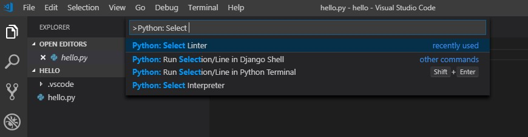

    * Enabling a linter prompts you to install the required packages in your selected environment for the chosen linter.
    
    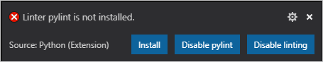

    6. It's simple to run hello.py with Python. Right-click in the editor and select Run Python File in Terminal (which saves the file automatically):
    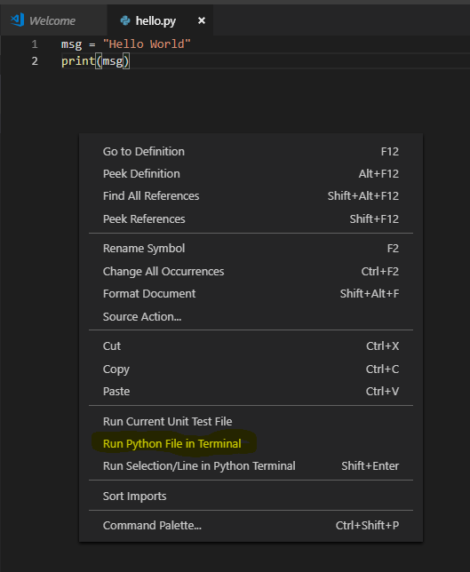

     * The command opens a terminal panel in which your Python interpreter is automatically activated
           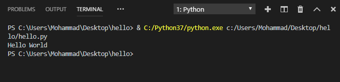

     * There are two other ways you can run Python within VS Code

        * Select one or more lines, then press Shift+Enter or right-click and select Run Selection/Line in Python Terminal. This command is convenient for testing just a part of a file.

        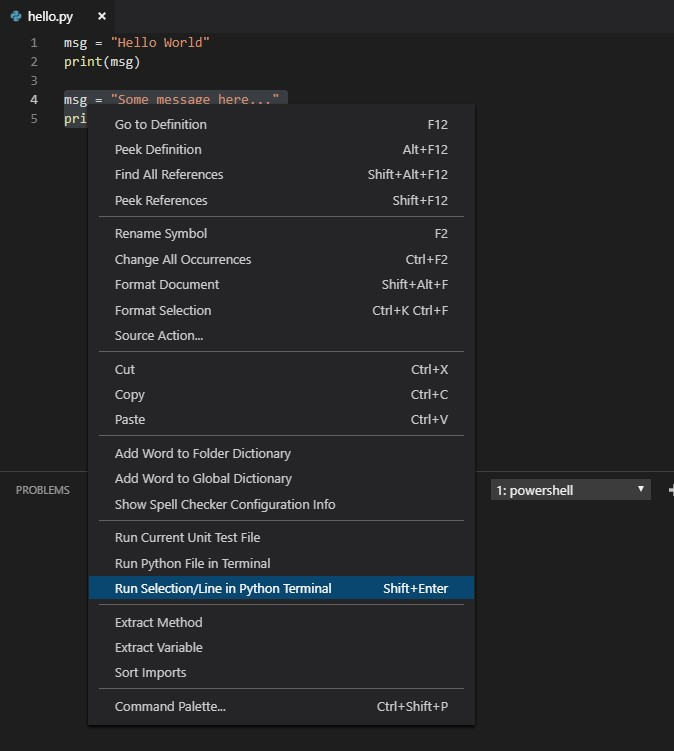

        *  Open terminal from **View > Terminal** menu. (Keyboard shortcut: Ctrl + ~)

        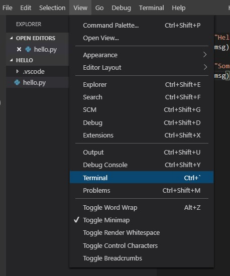


```bash
python hello.py
```

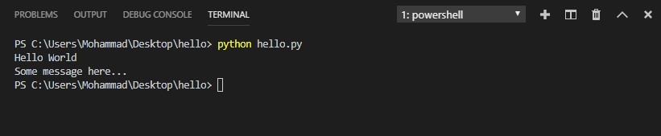
