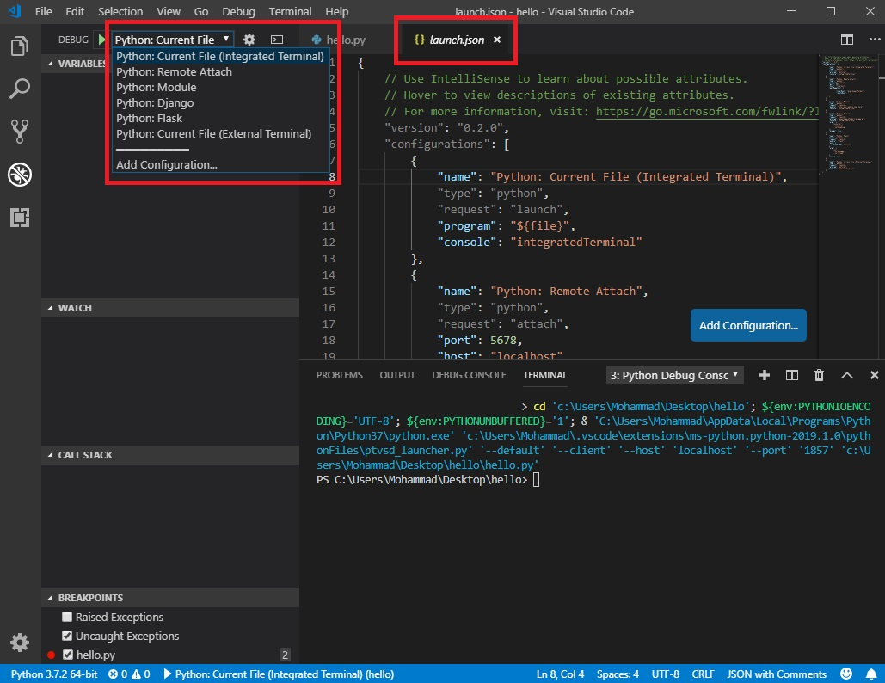

# Python debug configurations in Visual Studio Code

## Configure and run the debugger
1. Set a breakpoint on line 2 of hello.py by placing the cursor on the print call and pressing F9. 
    * Alternately, just click in the editor's left gutter, next to the line numbers. When you set a breakpoint, a red circle appears in the gutter.


2. Select the Debug View in the left sidebar


* If you don't yet have any configurations defined, you will see "No Configurations" in the drop-down list, and a dot on the settings icon

 

* A) Select the settings button (circled in the image above) or use the **Debug > Open configurations** menu command.
    * After a few moments, the command creates a launch.json file that contains a number of configurations, which appear in the configurations drop-down


* B) In the Select Environment drop-down list that appears, select Python.

 

 3. Save launch.json, switch to hello.py in the editor

 4. Run the debugger by selecting the arrow in the Debug toolbar or pressing F5

  

  * A debug toolbar appears along the top with the following commands from left to right: **continue (`F5`)**, **step over (`F10`)**, **step into (`F11`)**, **step out (`Shift+F11`)**, **restart (`Ctrl+Shift+F5`)**, and **stop (`Shift+F5`)**.

 

 5. Add new file  **sample.py** and paste code below in it

 ```python
var1 = 10

var2 = 15

var3 = var1 + var2

var2 = "Some text."

var4 = var2 * 2

var5 = sum_function(6 , 9)

print("var1=" , var1, "var2=" , var2, "var3=", var3, "var4=" , var4 , "sum=" , sum_function(var1 , var5))

def sum_function(x , y):
  return x + y
```

6. Debugging `sample.py`
    * Set a breakpoint at first line and start debugging tools
    * In sidebar, find **WATCH** section and click to add Expression
    * Type `var1` then press **Enter**
    * Press **step over (`F10`)** from debug toolbar at top


7. Do the all above debugging `sample.py` steps and this time press **step into (`F11`)** instead of **step over (`F10`)** and see the result

